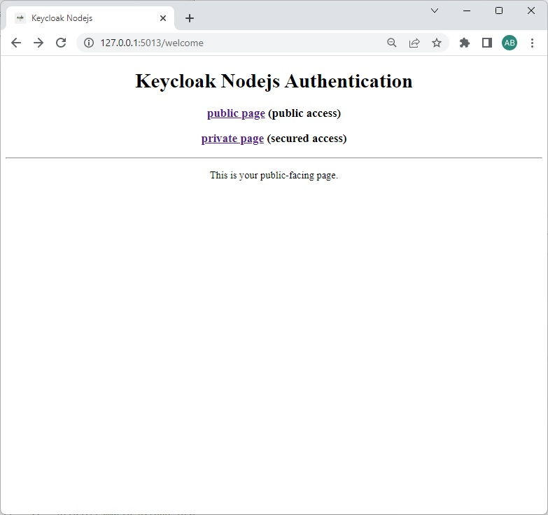
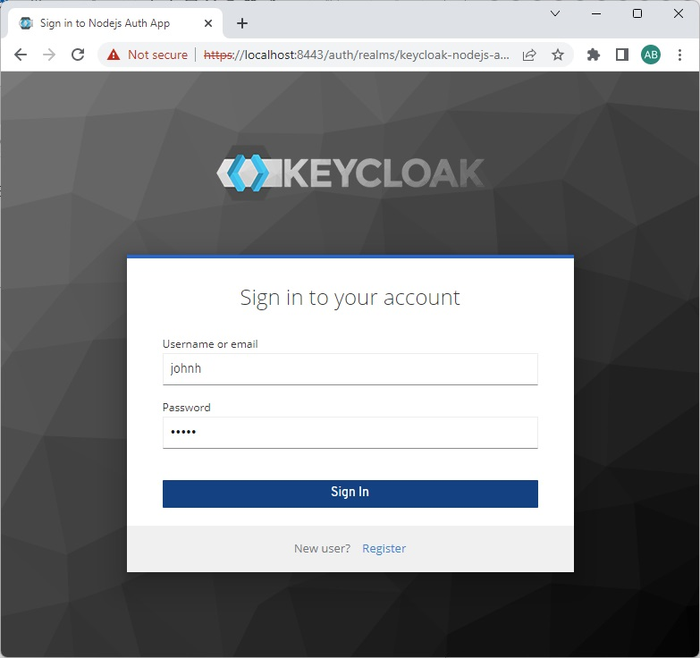
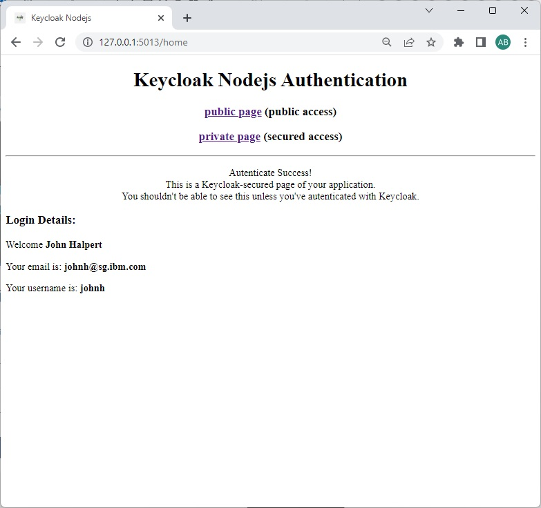

# Getting Started with Keycloak Nodejs Auth
Keycloak Nodejs Auth


## Getting Started
## For Local Development:
### Prerequsites
- Keycloak open source identity and access management.
    - [Keycloak Official Page](https://www.keycloak.org/)
- Configured keycloak realm.

### Terminal Commands
1. Install NodeJs from [NodeJs Official Page](https://nodejs.org/en).
2. Open a Console Terminal.
3. Navigate to the project folder.
4. Install app denpendency prep: $ `npm install`
5. Runs the app in the development mode: $ `npm start`
6. Open Chrome web browser with url: ```http://pont.sg.ibm.com:5011/```
7. App fires up as-is.

#




<!-- helm install -->
<!-- oc login console-openshift-console.apps.ocp4p.sg.ibm.com:6443
oc project think2020
./helm install telemedicine-stetho-app .\.ci\telemedicine-stetho-app\ -f .\.ci\telemedicine-stetho-app\values-telemedicine-stetho-app.yaml -->

<!-- Inference -->
<!-- https://smarto-python-instance-aa-instance-think2020.apps.9.187.17.27.nip.io -->
<!-- https://smarto-python-instance-aa-instance-ibm-think2020.apps-crc.testing -->


<!-- [CHANGELOG](./CHANGELOG.md) -->

